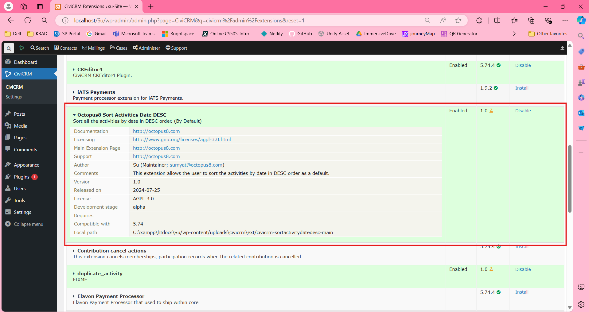
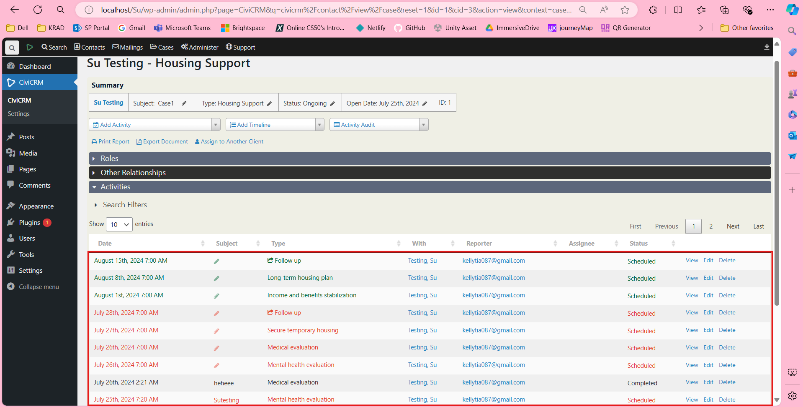

# Sort Activities by Date Descending Extension

This extension allows users to view activities sorted by date in descending order. The extension is activated for all user roles once it is installed.

## Getting Started

### Prerequisites

- CiviCRM installed and running.
- Appropriate permissions to install and manage extensions.

### Installation

1. Navigate to **Administer >> System Settings >> Extensions**.
2. Locate and install the extension named **Octopus8 Sort Activities Date DESC**.
   

### Usage

1. Once the extension is enabled, navigate to any Case.
2. Under the Case Activity section, the activities will be displayed in descending order by date and time by default.
3. The sorting will be by default for both activities itself and the activities under case.
   

## License

This extension is licensed under the [AGPL-3.0](LICENSE.txt).

## Support

For more information on CiviCRM extensions, refer to the [CiviCRM Documentation](https://docs.civicrm.org/sysadmin/en/latest/customize/extensions/).

For issues or contributions, please refer to the repository.

---

Feel free to reach out for further assistance or customization requests.
